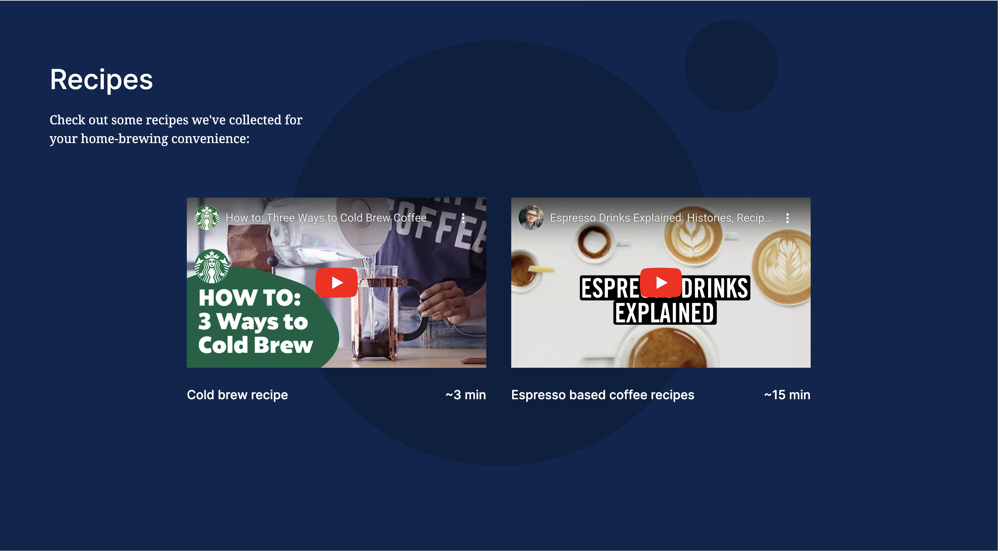
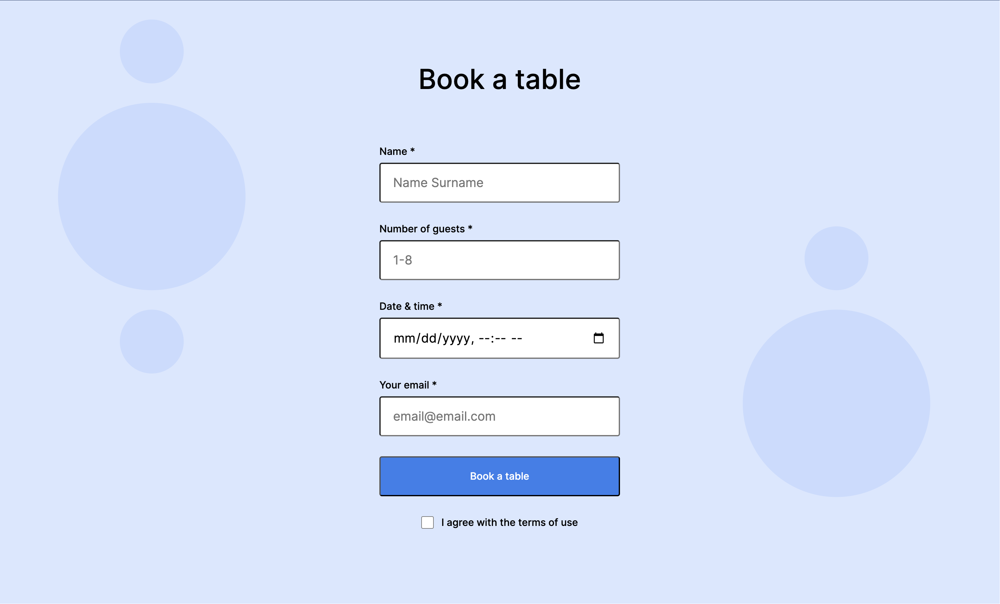
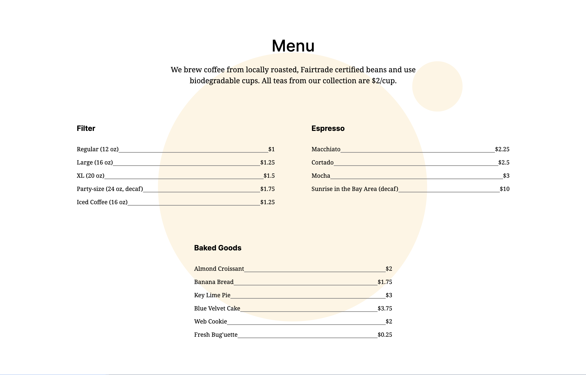

# Triple Peaks Coffee Shop

This is the second project of the Software Engineering program at TripleTen. It was created using HTML and CSS, based on the design brief, to showcase the ability to apply the knowledge and skill from covered sprints.

## Project features

- Semantic HTML5
- Flexbox
- Positioning
- Embedded video links
- Flat BEM file structure
- A custom form
- CSS animation and transform

## Project development

### 1. Stage 1

- Create the basic file structure
- Create the HTML page structure
- Add metadata to the page's `<head>`
- Outline the main blocks of the webpage
- Set up the fonts

### 2. Stage 2

- Set up webpage's _footer_ and _recipes_ section of `<main>` content, utilizing new skills to add embedded Youtube videos.

### 3. Stage 3

- Developing the _reservation_ section of `<main>` content, using forms.

### 4. Final Stage

- Refactor the file structure adhering to **Flat BEM file structure**.
- Add the _menu_ section of `<main>` content.
- Wrap up the remainder of the landing page by adding animation to the _about_ section, and completing the _footer_.

## Plan on improving the project

- Customize checkbox using CSS

## Project features

